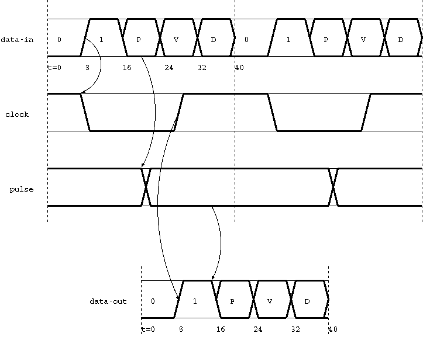

# rpi-pico-psst
PIO Synchronous Serial Transport for Raspberry Pi pico

## Summary

Functionally, one PSST link is equivalent to multiplexing a continuous
clock, a unidirectional SPI bus, and a pulse signal with
sub-microsecond deterministic delays over a single wire.
Two links (wires) provides bidirectional communications.
It's useful when building a distributed multi-node sensor and control
network having a daisy chain [topology](#Topology).

Project status is "alpha" - PIO programs running on a single pico board
all work and talk to each other, timings and delays have been verified
with a mixed signal oscilloscope.

## Performance

Given a 125 MHz system clock, the pulse sampling and clock are 3.125
MHz, and the multiplexed line bit rate is 2.5 times faster (about 7.8
MHz).
Note these speeds are relatively easy to route longer distances, and
fast enough for physical world interactions (eg, a multi-axis CNC
controller).

Gross timing is locked to the master node through the daisy chain -
the receive program detects each start of frame and signals (via an
IRQ) the transmit program to begin its frame.
Fine timing uses the local processor clock - both receive and transmit
programs count 8 clocks per bit.
Mixing picos using 125 and 133 MHz should[^1] just work as they stay within
1/4 bit width of each other within the critical period of each frame.

The serial data word width is 30 bits, chosen because it yields just
over 100k words/second and has extra bits for message routing or
tagging.
Bits are reliably aligned to words by dropping short words on receive.
Word size can be changed but requires minor code edits to left-justify
bits for transmit.
Data latency and throughput performance is dependent upon the
application handling each received word and passing it to the
transmitter.

The pulse signal reproduces any signal fed into it with sub-microsecond
accuracy.
Deterministic delay through each node is 1/2(*) the 3.125 MHz clock
period.
Amount of jitter will depend on number of picos in the chain as each
aligns the input signal to its internal clock.

The 3.125 MHz clock output is 50% duty cycle on a 125 MHz pico.
Amount of jitter will depend on number of picos in the chain as each
aligns the input signal to its internal clock.

[^1]: [Crystal accuracy](https://forums.raspberrypi.com/viewtopic.php?t=309414)
      is on the order of 30 PPM, compared to 64k PPM difference between
      125 and 133 MHz.

## (*) TODO list to exit alpha status

- [ ] switch to pindirs for pulse so it can emulate open drain
- [x] justify 30 bit word in the transmit program
- [ ] disable stability buffers on input pins (data and pulse)
- [ ] join FIFOs
- [x] move wdog /error from side-set to set pins
- [ ] APIs for serial data transmit and receive
- [ ] verify SM behavior during CPU debug (continue independently by default?)
- [ ] verify pico clock accuracy / tuning
- [ ] constraints on mixing 125 and 133 mHz?

## Components and Connections

The components diagram shows the three programs running on SMs of
the first two nodes of a unidirectional chain.

### GPIOs

Note that unused GPIOs do not need to be configured to a physical pin.

**/error** is asserted when the Watchdog times out.

**clock** is a 3.125 MHz square wave output.

**pulse** is a GPIO input (to Transmit) or output (from Receive)

**data-out** is the multiplexed signal output.

**data-in** is the multiplexed signal input.

### Programs

**Watchdog** provides the IRQ and clock on the master node.
TxFIFO must be periodically written with the next timeout to avoid
the chain stopping.

**Transmit** multiplexes clock, pulse, and words from TxFIFO to
data-out.

**Receive** demultiplexes from data-in to clock, pulse, and words to
RxFIFO.

### Interrupts

**IRQ** is generated at 3.125 MHz as a signal to Transmit to begin each
frame.

## Topology

Topology is very flexible, but also constrained by number of available
PIOs, SMs, program space, and physical distance between nodes.
Note that while the nodes are daisy chained together, they are really
just a series of point to point links which allows arbitrary handling
of both pulse and data at each node.

### Basics

The simplest unidirectional chain requires a watchdog and transmitter
on the master node, a receiver and transmitter on each secondary node,
and a receiver on the terminal node.

The loop can be closed by adding a transmitter on the terminal node
wired to a receiver added on the master node.

A bi-directional daisy chain can be achieved with either two
unidirectional chains, or skip the watchdog on the terminal node and
trigger its transmitter from its receiver.
A more dynamic chain can be achieved by eliminating the terminal node
and physically looping the connection on the last secondary node.

### With some additional work

Each transmitter requires an interrupt per frame, normally generated
by either a watchdog or receiver.
This means the master node requires an entire PIO for one bidirectional
chain.
Routing an external interrupt source to the SM eliminates the watchdog
and allows two chains per PIO.
Three transmitters in one PIO and three receivers in the second PIO
supports three bidirectional chains and maximizes program space
available to the unused SMs.

Any node which does not need to transmit data can simply tap the line
and be a receiver only.
Follow best practices suitable to the distance and environment to avoid
degrading the signal.

## Protocol

The diagram shows the (idealized) timing between various pins.

5 bits per frame:

* 0 = idle -- timing jitter will be seen here
* 1 = start -- rising edge begins the critical timing period
* P = pulse value -- sampled from gpio
* V = valid? -- 1 when frame contains a valid data bit
* D = data bit -- 0 when V=0

There is at least one "not valid" frame between each word which the
receiver uses to synchronize by discarding partial words.
Since V and D are both 0 here, the only rising edge will be for the
start bit, which ensures frame alignment at the receiver.

The receiver waits for the rising edge from idle to start.
The received pulse value is output to the pulse gpio.
The transmitted frame starts 1/2 the 3.125 MHz clock period after the
received frame, this ensures the pulse value propagates quickly and
reliably.

## License

This software is released under the
[BSD 3-clause](https://directory.fsf.org/wiki/License:BSD-3-Clause)
[license](LICENSE).
