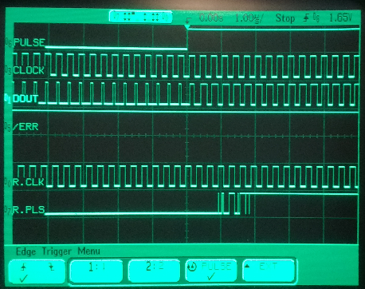
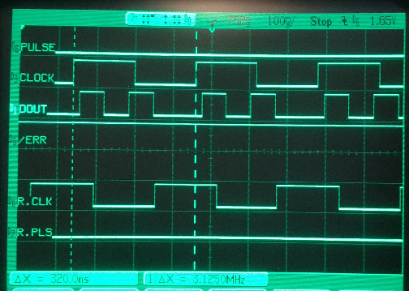
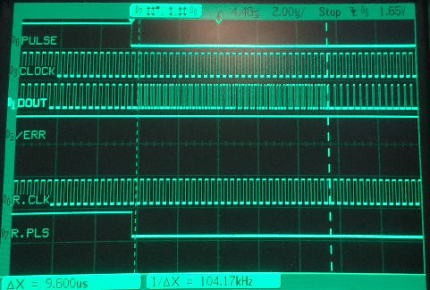
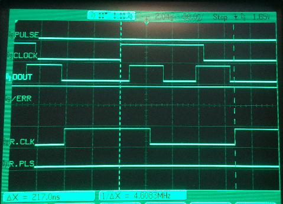
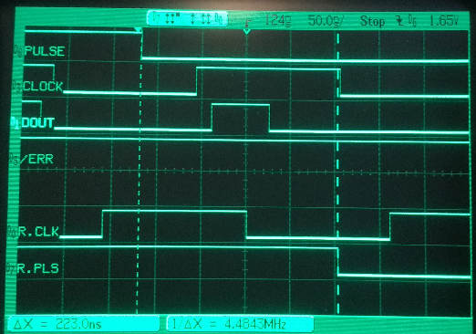
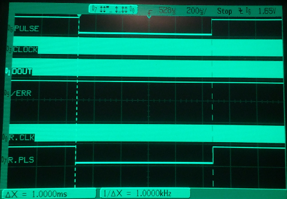
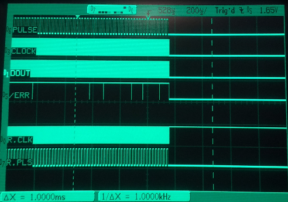
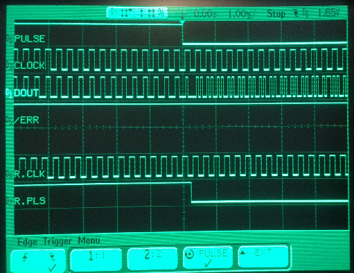

# Verification

Running psst-demo on a single pico (ie, same base clock to all SMs -
likely best case minimal delays).

## Overview

Generally checking that everything is working.
The demo code toggles pulse and sends a word each millisecond,
note the repeating DOUT pattern changes from 01100 to 01010.

* PULSE = input to TX
* CLOCK = output from WDOG
* DOUT = data-out from TX
* /ERR = /error output from WDOG
* R.CLK = clock output from RX
* R.PLS = /pulse output from RX

Note the noise on RX pulse output - needs an external pullup.

## Clock

System clock is 125 MHz (8 ns), 40 periods per frame measured at
3.125 MHz (320 ns).

## Serial Data Word

DOUT showing 30 bits - 320 ns / bit x 30 bits = 9.600 us.

## Clock Delay

Measuring clock delay from TX to RX = 217 ns.

After fixing input buffering, 1 clock cycle faster (210 ns).

## Pulse Propagation

Measuring pulse propagation from TX input to RX output = 223 ns.

After fixing input buffering, no change - not unexpected as the
pulse sampling is fixed within the frame, and the demo is not designed
to stress this delay.

## Watchdog Frequency

Measuring period between petting watchdog (rate limited by the WDOG
reading from its TxFIFO) = 1.000 ms.

## Watchdog Expired

Comment out the pet watchdog in the main loop, observe that everything
stops with /error asserted and clock low.

Note RX clock remains high as it does not toggle until a rising edge
on data-in is seen.

Note noise on /error - it needs an external pullup.

## Open Drain Drives Low

When driving RX output pulse low, it stays at 0 without noise.
Not ideal, but difficult to correct.
